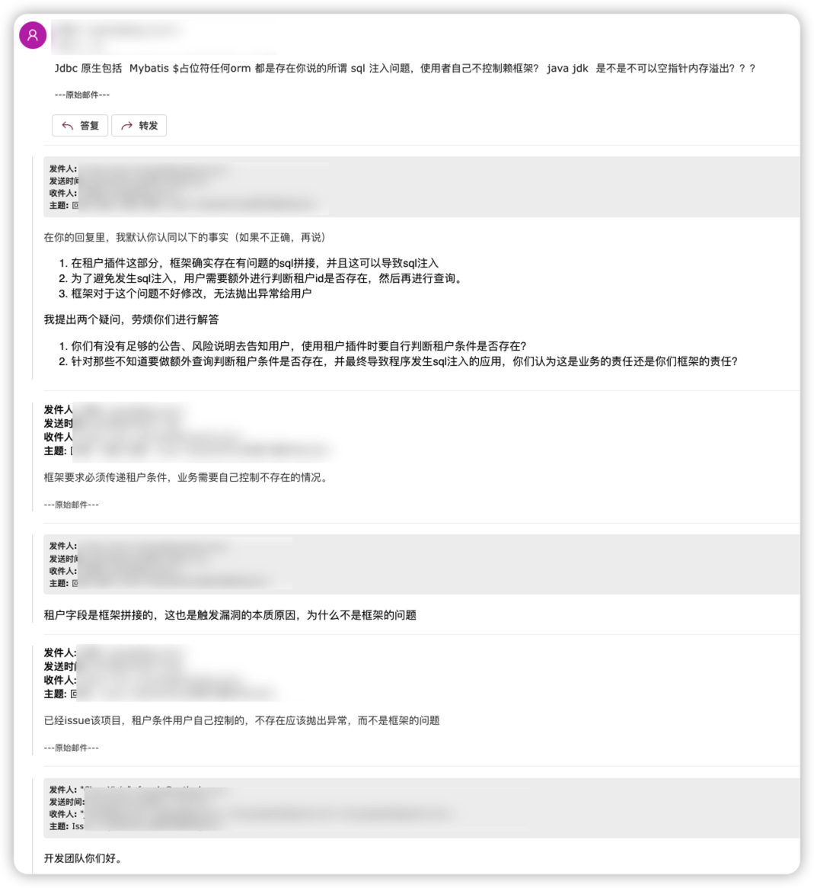

开发团队没有否认框架中在SQL注入的事实，但是他们对产生这个漏洞的责任方归属很有意见。

他们认为框架的用户在使用租户插件时，应该先检查租户id是否存在，然后再将租户id传入租户插件，所以如果用户没有做好检查，那么造成sql注入的责任就是用户自己；其次他们还拿 Mybatis 的 `${}` 问题来进行类比（用户在使用Mybatis的时候产生了SQL注入，这是用户对数据处理不恰当导致的），认为用户应该自己控制好数据输入。

1. 他们期望(假设)外部传入框架的数据都是干净的。很显然这个假设前提是不切实际的，不管是框架、系统等，原则上都是假设外部输入是不可信的。框架本身已经有了安全问题，他们不去做出改变，而是要求用户约束好自己的行为。。

2. Mybatis的`${}`问题（他们好爱拿这个来举例子）。"外部数据传入 Mybatis `${}` 可以造成SQL注入" - 这是一个已知的问题(漏洞)。一个应用因为外部不可控参数传入`${}`并导致SQL注入，我们不会去找Mybatis给他们提报漏洞（因为对于官方来说，这是一个已知的问题(漏洞)，官方给了足够的说明、警告、风险提醒、适用场景以及替代方案），我们会直接找这个应用去提报漏洞

但是对于MybatisPlus来说，几乎没有人知道在使用这个框架的时候要怎么避免SQL注入（要不是看了源码，我也不会知道他们什么都不处理就直接做字段拼接），两者根本没有可比性

难以想象一个大型项目会以这样的态度去对待产品潜在的安全威胁。不过他们修不修这个漏洞，对于我们来说也没有什么区别，不修更好，你好我也好。

> 经典语录之： “使用者自己不控制赖框架？”

